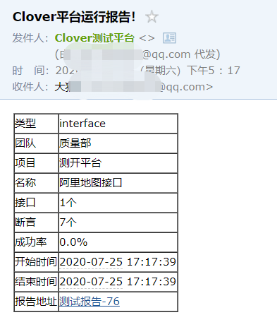
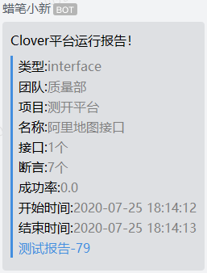

# 通知功能
Clover通知支持邮件、企业微信机器人和钉钉机器人三种方式。邮件方式和企微机器人方式的通知可以直接发送测试报告内容，测试报告内容包含报告在平台上的地址；目前钉钉机器人不支持直接发送测试报告内容，只能发送报告在平台上的地址。  

# 配置域名
用户点击通知里的报告链接可以打开测试报告页面，因此测试报告需要知道您部署的测试平台域名。域名配置在clover/config.py全局配置文件里。  
1. 如果您是开发者，请修改DOMAIN为http://localhost:3000。  
2. 如果您是用户，请修改您部署的域名或IP地址（端口也需要），例如您讲平台部署在10.23.25.36机器上，使用8080端口则这里配置DOMAIN=http://10.23.25.36:8080。
# 配置邮件
# 配置企微
# 配置钉钉
